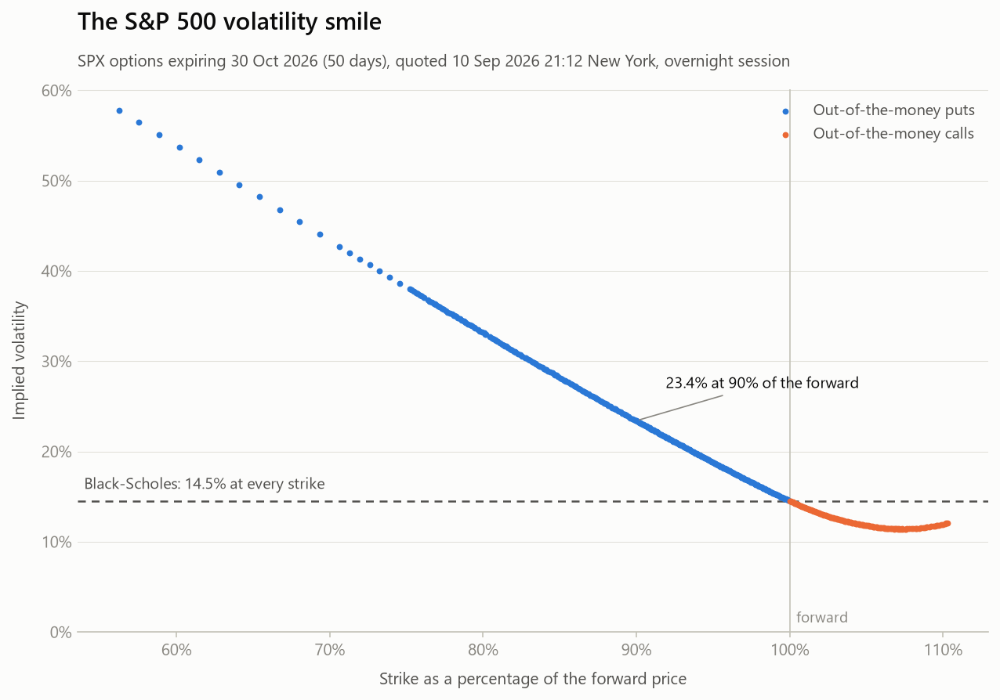
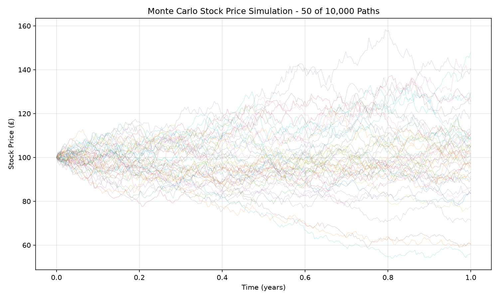
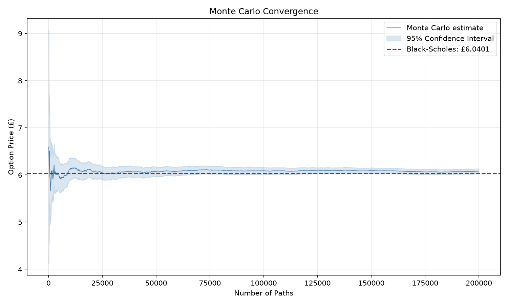
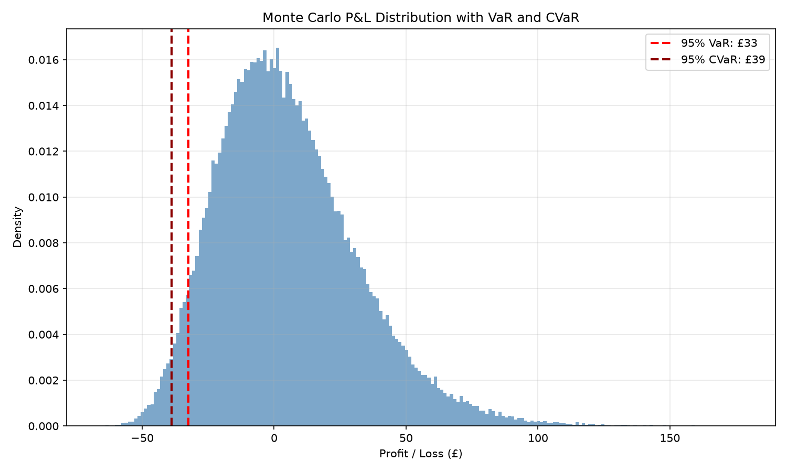

# Monte Carlo Price Simulator

[](https://github.com/justinz75/Monte-Carlo-Price-Simulator/actions/workflows/ci.yml)

Monte Carlo option pricing and portfolio risk in NumPy, benchmarked against closed-form
Black-Scholes, then checked against the real market. Covers European, Asian and barrier
options, correlated multi-asset portfolios, VaR/CVaR, two variance reduction techniques,
pathwise delta, and an implied volatility solver run on live S&P 500 option prices.



*Black-Scholes says this should be a flat line. It isn't. See [the volatility smile](#the-volatility-smile).*

## Running it

```bash
pip install -r requirements.txt
python main.py               # prices one European call, with a 95% confidence interval
python tests.py              # full demo: every pricer and check, saving the charts to plots/
python volatility_smile.py   # live SPX option chain to an implied volatility smile
```

`tests.py` opens matplotlib windows and saves each chart to `plots/`. To skip the windows:

```bash
MPLBACKEND=Agg python tests.py
```

`volatility_smile.py` needs an internet connection; `tests.py` does not. The smile script
picks the most liquid expiry near 50 days out (`--days 90` or `--expiry 2026-12-31` to
change it) and saves the chart and its data to `plots/`, named by the quote time. For a
regular-hours snapshot, run it between 09:30 and 20:15 New York.

## What's implemented

| Area | Functions |
| --- | --- |
| Path simulation | `simulate_gbm`, `simulate_correlated_portfolio` (Cholesky-correlated assets) |
| European options | `european_call`, `european_put`, `european_call_batched`, `european_call_parallel` |
| Closed form | `black_scholes_call`, `black_scholes_put`, both with an optional dividend yield `q` |
| Implied volatility | `implied_volatility` (Brent's method) |
| Greeks | `black_scholes_delta`, `monte_carlo_delta` (pathwise) |
| Path-dependent | `asian_call`, `asian_call_low_memory`, `up_and_out_call` |
| Risk | `monte_carlo_var` (VaR and CVaR) |
| Variance reduction | `call_antithetic`, `call_control_variate`, `monte_carlo_pricer` |
| Diagnostics | `convergence_plot` |
| Live market data | `volatility_smile.py`: SPX option chain to implied volatility smile |

Paths are simulated in `float32` to halve memory traffic, but every sum, mean and
variance accumulates in `float64` — `float32` accumulators lose meaningful precision
over hundreds of thousands of paths.



## Results

### The volatility smile

Everything else in this project assumes Black-Scholes, where volatility is a property
of the underlying: one number, the same at every strike. `volatility_smile.py` tests that
against the market. It pulls the live SPX option chain, works out the volatility each
option's price implies, and plots it by strike (the chart at the top).

SPX options expiring 30 Oct 2026 (50 days), quoted at 21:12 New York on 10 Sep 2026, in
Cboe's overnight session:

| strike, as % of the forward | implied volatility |
| ---: | ---: |
| 80% | 33.2% |
| 90% | 23.4% |
| 95% | 18.8% |
| 100% (at the money) | 14.5% |
| 105% | 11.8% |

It is nowhere near flat. A put struck 20% below the forward is priced at more than twice
the at-the-money volatility. This is the skew, and there are two standard explanations
for it: investors buy puts as portfolio insurance, and volatility tends to jump when the
market falls, which makes big drops more likely than a lognormal model allows. A single
Black-Scholes volatility can't produce this shape at all.

**How the vols are computed**

- **SPX rather than SPY.** SPX options are European-style, so Black-Scholes applies
  exactly. SPY options are American and carry an early exercise premium.
- **One contract type.** On monthly dates the chain lists both AM-settled and PM-settled
  contracts, which expire hours apart. Only the PM-settled SPXW contracts are used.
- **Out-of-the-money options only.** Their price is all time value. An in-the-money price
  is mostly intrinsic value, so a small quoting error becomes a large volatility error.
- **Mid prices, from two-sided quotes** with a spread under 25% of the mid.
- **The forward comes from the options, not the index.** Put-call parity,
  `C - P = exp(-rT)(F - K)`, gives the forward straight from call and put prices. That
  takes care of dividends without looking them up.
- **Brent's method rather than Newton-Raphson.** Newton can diverge far from the money,
  where vega is close to zero. Brent always converges once the answer is bracketed.

**Three problems in the live data, and how they were caught**

1. **A negative dividend yield.** On the first run, from the closing quotes, backing a
   dividend yield out of the index level and the forward gave -0.37%, which the S&P 500
   can't have. The cause was timing: the index closes at 16:00 but SPX options quote
   until 16:15, and S&P futures rose 0.10% in that window (7,598.00 to 7,605.75).
   Adjusting for the move makes the yield positive. This is why every vol is anchored
   to the options' own forward rather than to the index close.
2. **Stale quotes that implied free money.** On the same run, four puts sat well below the
   curve. Each was priced *below* the put one strike lower: the 6865 put at 22.80 against
   33.10 for the 6860. A higher-strike put can never be worth less, so you could buy it,
   sell the other, and keep the difference with no risk. None of the four had traded
   since 3-5 August. The script now drops quotes that break this ordering.
3. **Quotes that moved with no trades.** A rerun at 21:04 New York gave a different forward
   from the same chain, though nothing had traded since 16:14. SPX options also trade in
   an overnight session on Cboe while the index is shut, and the quotes had followed S&P
   futures up another 0.09% (7,605.75 at 16:14 to 7,612.75 at 20:58). The script now
   spots the overnight session, values the options at the time they were fetched, and
   puts the time in the file name so one snapshot can't overwrite another. The chart at
   the top is one of those overnight snapshots.

**Checks on the result**

- Put-call parity means a call and a put at the same strike must imply the same
  volatility. With the options' forward they agree to a median 0.01 vol points. Price
  them off the index close with no dividends instead and they disagree by 1.29.
- `tests.py` runs the whole pipeline offline on a synthetic chain with a known forward and
  a known skew, and recovers both exactly.

### Convergence to Black-Scholes



European call, `S0=100, K=110, r=0.05, sigma=0.2, T=1.0`, the same one as below, priced
with more and more paths. The Black-Scholes price stays inside the 95% confidence band at
every checkpoint, and the band narrows from ±0.72 at 1,000 paths to ±0.05 at 200,000:
200 times the paths for 14 times the precision. That 1/√n rate is what makes variance
reduction worth having.

### Variance reduction

European call, `S0=100, K=110, r=0.05, sigma=0.2, T=1.0`. Black-Scholes gives **£6.0401**.

All four methods get the same budget of 100,000 standard normal draws. This matters:
antithetic sampling consumes two draws per path, so it is given half the path count.
Comparing 100k standard paths against 10k antithetic *pairs* is a 5x budget difference
and makes antithetic look about 90% worse than it actually is.

| method | price | std error | vs standard |
| --- | ---: | ---: | ---: |
| standard | £6.0906 | 0.03692 | — |
| antithetic | £6.0283 | 0.03137 | 15.0% |
| control variate | £6.0450 | 0.01940 | 47.5% |
| antithetic + control | £6.0433 | 0.00704 | **80.9%** |

Antithetic sampling alone is weak here because the call payoff is convex and this strike
is out of the money — one leg of most pairs contributes nothing. The control variate
(terminal stock price, whose risk-neutral expectation `S0·exp(rT)` is known exactly)
does most of the work, and the two compose well.

### Delta

Delta is how much an option's price moves per £1 move in the stock, and it is the number
of shares a trader holds to hedge the option. `monte_carlo_delta` estimates it with the
pathwise method: differentiate each path's payoff with respect to `S0`. For a call that
is `exp(-rT) · S_T / S0` on paths that finish in the money and zero on the rest, so delta
comes out of the same simulation as the price, with no bumping and re-pricing.

`S0=100, r=0.05, sigma=0.2, T=1.0`, 100,000 paths:

| option | strike | Monte Carlo delta | std error | Black-Scholes delta |
| --- | ---: | ---: | ---: | ---: |
| call | 90 | 0.8116 | 0.0015 | 0.8097 |
| call | 100 | 0.6396 | 0.0018 | 0.6368 |
| call | 110 | 0.4529 | 0.0019 | 0.4496 |
| put | 90 | -0.1893 | 0.0010 | -0.1903 |
| put | 100 | -0.3613 | 0.0013 | -0.3632 |
| put | 110 | -0.5480 | 0.0014 | -0.5504 |

Every estimate is within 2 standard errors of Black-Scholes. They all sit slightly above
it because every strike reuses the same 100,000 paths, which happen to run a little high:
the same draws price the call at £6.0906 against £6.0401 in the variance reduction table.

The pathwise method needs the payoff to be continuous in `S_T`. That holds for calls and
puts, but a digital option's payoff jumps at the strike, so its pathwise delta is zero on
every path. Digitals need a likelihood-ratio or finite-difference estimator instead.

### Value at Risk



One-year profit and loss on a £100 stock with 5% drift and 25% volatility, from 100,000
paths. The 95% VaR is £32.50: one year in twenty, the loss is at least that. The CVaR,
the average loss across that worst 5%, is £38.94.

### Barrier monitoring frequency

`up_and_out_call` checks the barrier at `n_steps` discrete dates, so the price is a
function of the monitoring frequency. Up-and-out call, `S0=100, K=100, B=130,
r=0.05, sigma=0.25, T=1.0`, 200,000 paths:

| n_steps | price |
| ---: | ---: |
| 50 | 2.7304 |
| 252 | 2.4467 |
| 1008 | 2.3296 |
| 4032 | 2.3020 |

That is a 19% swing, roughly 35 standard errors — discretization bias, not noise. More
monitoring dates means more chances to knock out, so the price falls. Daily monitoring
(252) is a real contract specification, but it is *not* an approximation to the
continuously monitored price, and this function does not claim to be one.

## Known limitations

- **The barrier is discretely monitored.** See the table above. Converting to a
  continuous-barrier price needs a continuity correction (Broadie-Glasserman-Kou).
- **Control variate betas are fitted in-sample.** `call_control_variate` and
  `monte_carlo_pricer` estimate beta from the same paths they price with. Measured over
  40 seeds at 100,000 paths, `monte_carlo_pricer` reports a standard error about 10%
  below the spread actually observed (0.00497 reported vs 0.00558 realised). The prices
  themselves show no detectable bias. Fitting beta on a held-out pilot batch would fix it.
- **GBM only** — constant volatility, no jumps, no stochastic vol. The volatility smile
  above is the market's evidence that this matters.
- **The smile is one snapshot of free Yahoo Finance data**, built from mid prices rather
  than prices you could trade at, and the one above is from the overnight session.
  Rerunning at another time gives a different chart.
- **The overnight session hours are hard-coded**, roughly 20:15 to 09:15 New York, and
  exchange holidays are ignored.
- **The stale-quote filter assumes stale quotes are isolated.** Deep in-the-money SPX
  quotes on Yahoo are often stale in runs (some last traded in May), which fools a check
  that judges each quote by its neighbours. So the filter only sees the out-of-the-money
  quotes the smile is built from; the forward and the call-put check use medians instead.
- **`european_call_parallel` is unbenchmarked** and seeds workers with `seed + worker_id`,
  which does not guarantee independent streams. `np.random.SeedSequence(seed).spawn(n)`
  is the correct approach. It also ships full payoff arrays back through pickle rather
  than partial sums.

## Roadmap

- Quasi-Monte Carlo with scrambled Sobol sequences. Measured on this pricer, Sobol is
  ~320x more accurate than pseudorandom sampling at 65,536 paths, and the gap widens
  with path count — a far bigger win than any of the current optimisations.
- A pytest suite replacing the demo script: MC within 3 standard errors of Black-Scholes,
  put-call parity, geometric Asian against its closed form, barrier ≤ vanilla.
- Gamma by finite differences with common random numbers, to go with the pathwise delta.
- Collapse the six near-duplicate terminal-price samplers into one engine taking a
  payoff function, so variance reduction and QMC apply to every product.
- Fit a model that can produce a skew, Merton jump-diffusion or Heston, and compare its
  smile against the market's.
- Plot several expiries on one chart to see how the skew changes with maturity.

## Correctness checks

`tests.py` asserts:

- **Put-call parity, Black-Scholes**: `C - P = S0 - K·exp(-rT)` holds to ~1e-15.
- **Put-call parity, Monte Carlo**: the call and put share a seed, so the only parity
  error is the sampling error in the mean terminal price. The tolerance is derived from
  that quantity rather than picked by hand.
- **Dividend yield**: pricing with a yield `q` matches pricing from a spot reduced by the
  dividends paid, `S0·exp(-qT)`, to 1e-10. That tests the `q` terms against the `q = 0`
  formula instead of against themselves.
- **Implied volatility**: 18 options priced at known volatilities are all recovered to
  within 1e-6, and an impossible price returns `nan`.
- **The smile pipeline, offline**: a synthetic chain with a known forward and a known
  skew goes through the same functions as the live data, and both come back exactly.
- **The stale-quote filter**: it keeps a clean chain whole, and catches a planted stale
  quote whether it is too cheap or too dear.
- **Delta**: the Black-Scholes delta matches a finite difference of the Black-Scholes
  price to 1e-6, call and put deltas differ by exactly `exp(-qT)`, and the pathwise Monte
  Carlo delta lands within 4 standard errors of Black-Scholes for calls and puts at three
  strikes.
